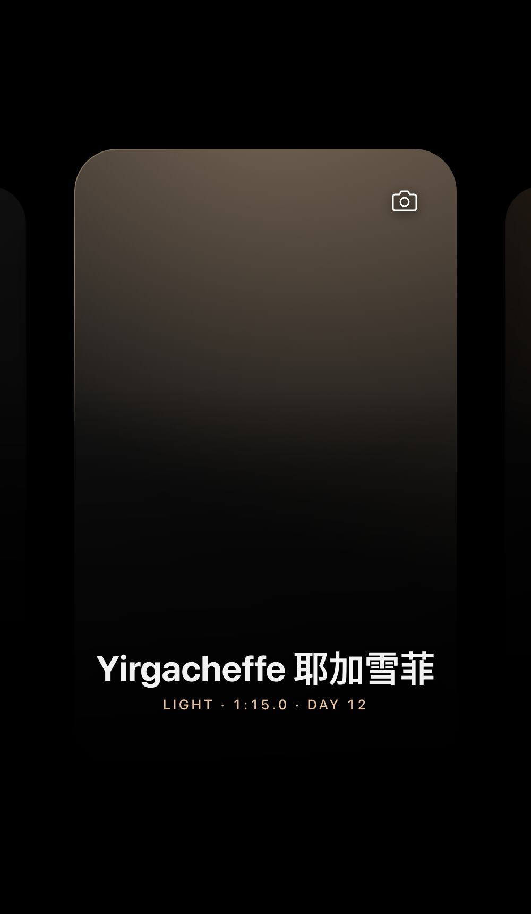
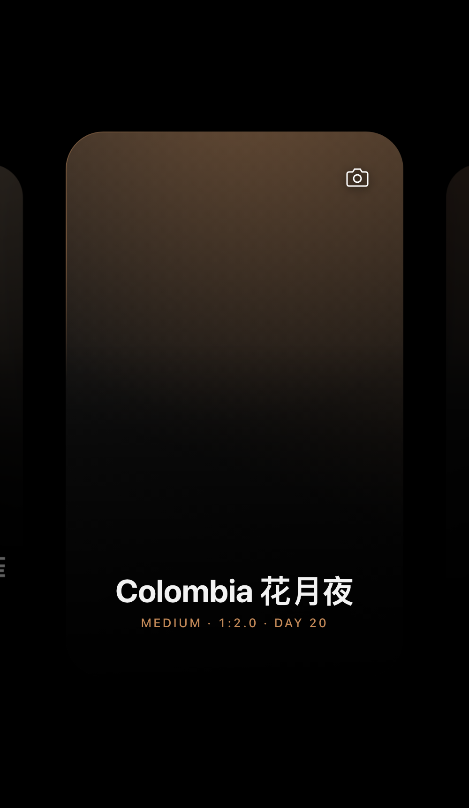
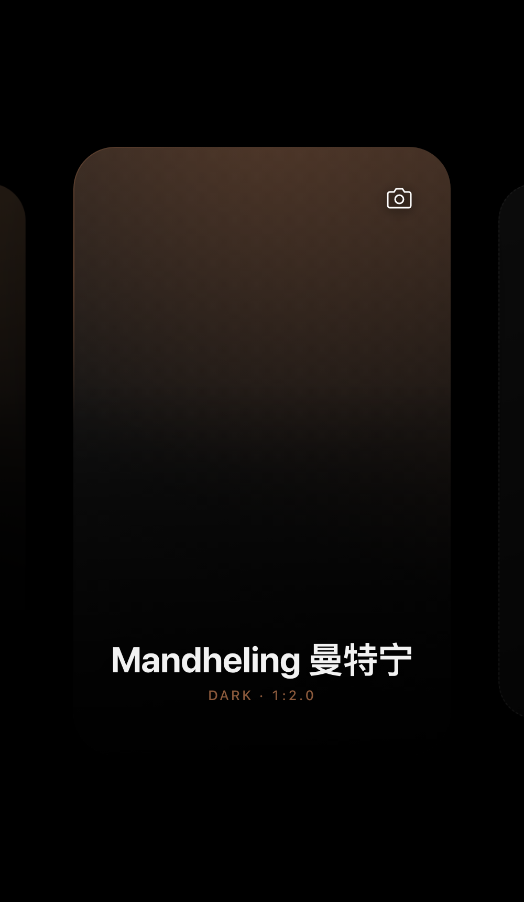
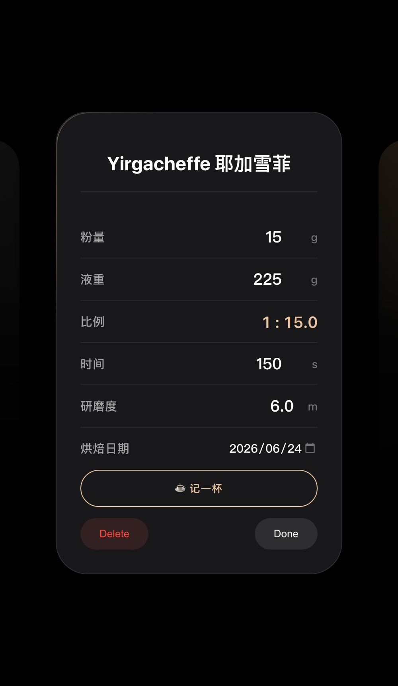

# ☕ BeanDance

一个单文件的咖啡冲煮手帐 PWA——每颗豆子一张卡片，正面是豆子的脸，背面是它的冲煮档案。

**在线使用**：<https://caiman001.github.io/beandance/>（加到主屏幕即可当 App 用，支持离线）
**在线试玩**：<https://caiman001.github.io/beandance/?demo>（示例数据，不影响你的记录）

## 预览

| 浅烘 | 中烘 | 深烘 | 冲煮档案 |
|---|---|---|---|
|  |  |  |  |

## 功能

- **卡片式豆单**：横滑浏览，点击翻转卡片，上传豆袋/豆子照片做封面
- **烘焙度色彩主题**：浅烘蜂蜜金 / 中烘焦糖棕 / 深烘深可可，卡片氛围、流光边框随烘焙度变化，背面可随时切换
- **冲煮参数**：粉量、液重、时间、研磨度，**粉水比自动计算**
- **养豆期**：填烘焙日期，卡片正面自动显示 `DAY N`
- **冲煮历史**：调好参数点「☕ 记一杯」存档一条记录，参数继续留作当前配方
- **下拉搜索**：豆单里下拉呼出搜索，按名字直达卡片
- **完整备份**：导出/导入 JSON，照片和冲煮历史一并打包，换机不丢数据
- **离线 PWA**：Service Worker 缓存，飞行模式也能打开

## 数据说明

所有数据存在浏览器本地（IndexedDB），不经过任何服务器。换设备或清浏览器数据前，请先在「+」卡片上点 **EXPORT** 导出备份。

## 技术

单个 `index.html`，零依赖、零构建。外加 `manifest.json` + `sw.js` 组成 PWA。

---

*by CAIMAN*
